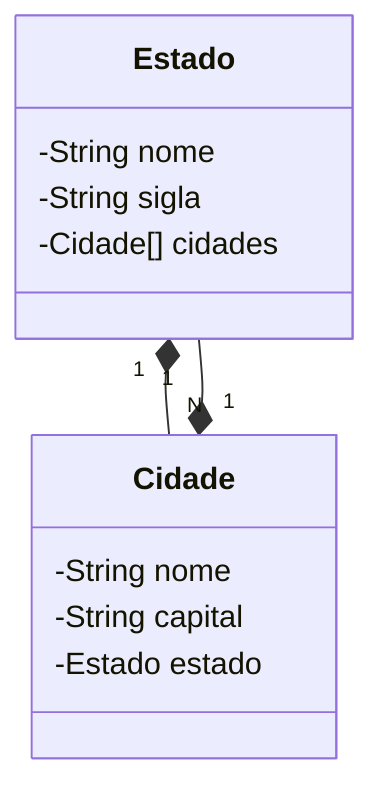

# Desafio DIO 2024 - Java API

Este projeto é uma RESTful API desenvolvida como parte do Desafio DIO, utilizando Java 17 e Spring Boot 3.

## Tecnologias Utilizadas

- **Java 17**: A versão LTS mais recente do Java, proporcionando acesso às mais modernas funcionalidades da linguagem, reconhecida por sua robustez e ampla adoção.

- **Spring Boot 3**: A nova versão do Spring Boot que potencializa a produtividade do desenvolvedor por meio de autoconfiguração e uma experiência de desenvolvimento simplificada.

- **Spring Data JPA**: Uma ferramenta que simplifica a camada de acesso a dados, facilitando a integração com bancos de dados SQL e otimizando consultas.

- **OpenAPI (Swagger)**: Usaremos OpenAPI (Swagger) para criar uma documentação de API clara e acessível, alinhada com a eficiência proporcionada pelo Spring Boot.

## Diagrama de Classes

O diagrama abaixo representa o domínio da API:

## Documentação da API

A documentação da API pode ser acessada por meio do Swagger no seguinte link:

### [http://localhost:8080/dio/swagger-ui/index.html](http://localhost:8080/dio/swagger-ui/index.html)

## H2 Console

Para acessar o console do H2, utilize o link abaixo:

### [http://localhost:8080/dio/h2-console](http://localhost:8080/dio/h2-console)

Durante o desenvolvimento, utilizamos o H2 como banco de dados Java SQL. Para configurar o banco de dados, criamos os arquivos `schema.sql` e `data.sql` na raiz da pasta `resources`, permitindo que o Spring Boot crie e preencha automaticamente o banco de dados H2.

## Contribuições

Sinta-se à vontade para contribuir com melhorias e sugestões. Agradecemos seu interesse e colaboração!
